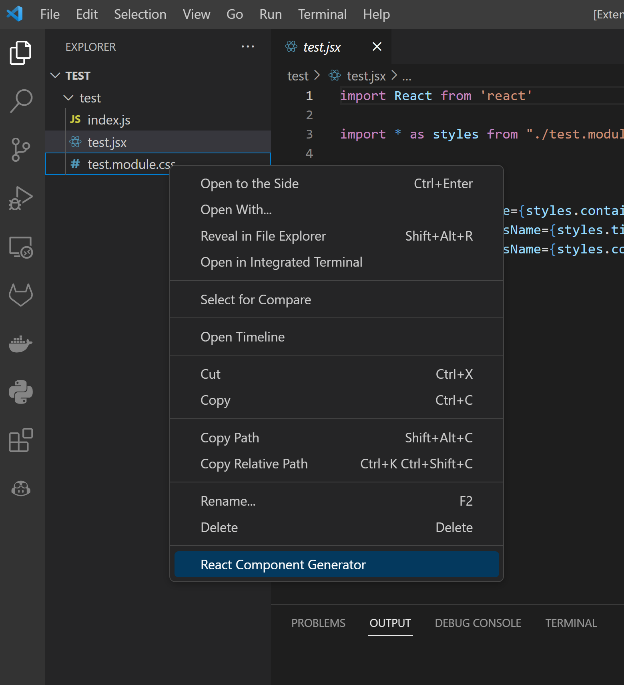
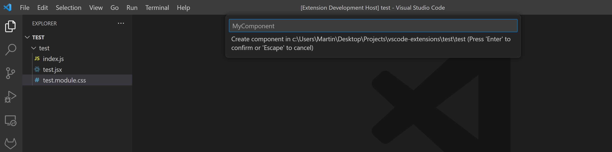

# React Component Generator

This extension allows you to generate React component files by clicking on the `React Component Generator` option in the context menu.



It will prompt you for the name of the component.



It will then create a folder with the name of the component and create three files inside it: `component-name.jsx`, `component-name.module.css`, and `index.js`. The `component-name.js` file will contain the component code, the `component-name.css` file will contain the component's styles, and the `index.js` file will contain the code to export the component.

### Generated Files

Here is an example of what the generated files will look like:

```bash
├── component-name
│   ├── component-name.module.css
│   ├── component-name.js
│   └── index.js
```

**Contents of `component-name.js`:**

```jsx
// component-name/component-name.jsx
import React from 'react';

import * as styles from './component-name.module.css';

const ComponentName = () => {
  return (
    <div className={styles.container}>
      <div className={styles.title}>ComponentName</div>
      <div className={styles.content}></div>
    </div>
  );
};

export default ComponentName;
```

**Contents of `component-name.module.css`:**

```css
/* component-name/component-name.module.css */
.container {
}

.title {
}

.content {
}
```

**Contents of `index.js`:**

```jsx
// component-name/index.js
export { default as ComponentName } from './component-name';
```

